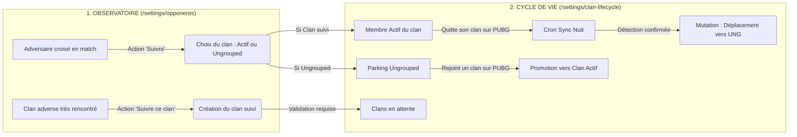

# Architecture & Rationalisation : Observatoire des Joueurs & Cycle de Vie des Clans

> **Document de référence & Spécification fonctionnelle**  
> **Destiné au SuperUser et à l'équipe de développement**  
> *Date : 25 septembre 2026*  
> *Statut : Proposition d'évolution validée en conception*

---

## 1. Contexte & Problématique

Au sein de l'espace d'administration SuperUser du site, deux écrans majeurs gèrent les entités « Joueurs » et « Clans » :
1. **`/settings/opponents`** (*« Adversaires »*) : Historiquement conçu pour observer les clans et joueurs croisés lors des matchs télémétriques.
2. **`/settings/clan-lifecycle`** (*« Cycle de vie des clans »*) : Conçu pour détecter les changements de clans des membres suivis, gérer le parking `Ungrouped` et valider les nouveaux clans.

### Le constat d'usage du SuperUser
* **Une frontière floue** : La première page ajoute des joueurs et des clans (via les boutons « Suivre », « Ajouter à l'effectif »), tandis que la seconde gère les mutations de clans et les approbations de clans découverts.
* **Le chaînon manquant dans `/settings/opponents`** : Bien que l'onglet `[Explorer]` liste les clans découverts et que `[Triage]` serve de file d'attente technique pour l'API PUBG, il est **impossible de rechercher directement un joueur individuel** pour savoir en 1 seconde s'il est déjà membre suivi (et dans quel clan) ou s'il s'agit d'un simple joueur croisé/non suivi.
* **Un besoin de lisibilité et de cohérence** : Clarifier la finalité de chaque écran pour que le SuperUser sache instantanément où aller pour chaque geste opérationnel.

---

## 2. Le Modèle Mental Unifié : Découverte vs Gouvernance

Pour éliminer toute ambiguïté, les deux écrans doivent être compris comme les deux volets complémentaires d'un entonnoir :

```
MONDE EXTÉRIEUR (Matchs PUBG)
         │
         ▼
┌────────────────────────────────────────────────────────┐
│   1. OBSERVATOIRE & SCOUTING (/settings/opponents)     │
│   • Découverte de clans et joueurs croisés             │
│   • Annuaire transverse des joueurs (suivis / non)     │
│   • Triage technique et résolution de tags PUBG        │
│   • Décision de suivi : joueur -> Clan / Ungrouped     │
└──────────────────────────┬─────────────────────────────┘
                           │ Intégration dans le périmètre suivi
                           ▼
┌────────────────────────────────────────────────────────┐
│   2. CYCLE DE VIE & GOUVERNANCE (/settings/clan-lifecycle)│
│   • Vérité terrain : détection des départs / arrivées  │
│   • Gestion des mutations (transferts, rétrogradations)│
│   • Sas de validation des clans en attente             │
│   • Parking Ungrouped & règles d'inactivité/archivage │
└────────────────────────────────────────────────────────┘
```

### Tableau comparatif des responsabilités

| Dimension | `/settings/opponents` (Observatoire & Joueurs) | `/settings/clan-lifecycle` (Cycle de vie & Gouvernance) |
| :--- | :--- | :--- |
| **Finalité** | **Scouting, Découverte & Annuaire** | **Cohérence, Vérité terrain & Règles métier** |
| **Public ciblé** | Tout l'écosystème PUBG croisé en match (inconnu, adverse ou déjà suivi). | Les membres et clans **faisant déjà partie du périmètre suivi**. |
| **Question à laquelle la page répond** | *« Qui avons-nous croisé en match ? Le joueur X est-il suivi chez nous ? Quel est son clan PUBG ? Voulons-nous le suivre ? »* | *« Nos membres sont-ils toujours dans leurs clans PUBG ? Qui a changé de clan ? Quels clans demandent à être validés ? »* |
| **Gestion des joueurs** | Recherche transverse de n'importe quel pseudo, affichage du statut de suivi, action **« Suivre »** pour l'intégrer à un clan ou à Ungrouped. | Détection quotidienne des désalignements PUBG, mutations automatiques, gestion de l'inactivité au parking **Ungrouped**. |
| **Gestion des clans** | Classement des clans rivaux par volume de rencontres, pourcentage d'affrontements vs coéquipiers (*fill squad*), clans favoris. | Sas d'approbation/rejet des nouveaux clans (`pending`), paramétrage du coupe-circuit et des confirmations. |

---

## 3. Spécification : Le Nouvel Onglet « Joueurs » (`/settings/opponents/players`)

Pour combler le manque actuel, nous intégrons un onglet **`Joueurs`** au cœur de l'Observatoire.

### A. Objectifs & Bénéfices
1. **Recherche instantanée** : Trouver n'importe quel joueur par son pseudo PUBG sans devoir deviner dans quel clan il se trouve.
2. **Statut d'affiliation immédiat** : Savoir en un coup d'œil si le joueur est :
   * 🟢 **Membre suivi actif** (ex: `[SMK] Smoke`, `[BEE] Killer Bees` ou `[UNG] Ungrouped`).
   * ⚪ **Joueur non suivi** (adversaire rencontré ou coéquipier fortuit).
   * 🟡 **Membre archivé** (ancien membre du parking désactivé pour inactivité).
3. **Action directe d'intégration** : Pouvoir le suivre immédiatement dans un clan choisi via un menu déroulant ou le transférer.

### B. Maquette & Expérience Utilisateur

#### 1. En-tête & Compteurs KPI transverses
Quatre cartes pour donner la volumétrie globale :
* **Total Joueurs répertoriés** : Ensemble des comptes PUBG connus en base.
* **Membres suivis** : Joueurs actifs enregistrés dans `ClanMember` (nos clans + Ungrouped).
* **Joueurs non suivis** : Joueurs adverses ou coéquipiers occasionnels croisés en match.
* **Joueurs solo** : Joueurs confirmés sans aucun clan PUBG affilié.

#### 2. Filtres rapides (Segmented Pills) & Recherche
* **Segmented Control** :
  * `Tous`
  * `Suivis uniquement` *(Membres actifs)*
  * `Non suivis` *(Adversaires / Croisés)*
  * `Sans clan PUBG` *(Solo)*
  * `Favoris ⭐`
* **Champ de recherche** :
  * Recherche réactive par préfixe ou sous-chaîne sur `pubgPlayerName`.
* **Filtre par clan d'observation** :
  * Sélecteur pour filtrer les joueurs ayant été croisés par une équipe spécifique (ex: *Croisés par [SMK]*).

#### 3. Tableau de données

| Joueur | Statut de suivi | Clan PUBG (in-game) | Rencontres globales | Dernière vue | Actions |
| :--- | :--- | :--- | :--- | :--- | :--- |
| ⭐ **Lord_Kromb** | 🟢 `[SMK] Membre actif` | `[SMK] Smoke` | **84** *(72 ennemi / 12 fill)* | *il y a 2 h* | [Profil interne] [Lookup ↗] |
| ☆ **ShadowSniper** | ⚪ `Non suivi` | `[RATZ] Ratz Gang` | **18** *(18 ennemi / 0 fill)* | *il y a 3 j* | **[+ Suivre dans un clan ▾]** [Lookup ↗] |
| ☆ **RandomGuy99** | ⚪ `Non suivi` | *Solo / Aucun clan* | **4** *(1 ennemi / 3 fill)* | *il y a 5 j* | **[+ Suivre dans un clan ▾]** [Lookup ↗] |
| ☆ **OldMember** | 🟡 `Archivé` *(UNG)* | `[WLF] Wolfpack` | **29** *(29 ennemi / 0 fill)* | *il y a 18 j* | **[Réactiver / Déplacer]** [Lookup ↗] |

#### 4. Actions rapides disponibles
* **Bouton « Suivre dans un clan »** :
  * Ouvre un menu popover listant les clans suivis (`SMK`, `BEE`, etc.) ainsi que le clan technique `Ungrouped (UNG)`.
  * L'action appelle `POST /api/settings/opponents/track` :
    * Si le joueur n'était pas suivi, il est créé en `ClanMember` avec statut `joinStatus: 'active'`.
    * Si le joueur était déjà rattaché à un autre clan suivi, le garde-fou 409 `member_tracked_elsewhere` alerte le SuperUser et demande confirmation explicite avant tout transfert.
* **Favori ⭐** :
  * Bascule instantanée sur `PATCH /api/settings/players/[id]/favorite`.
* **Liens externes & profils** :
  * Lien PUBG Lookup vers la fiche joueur officielle.
  * Lien interne vers le tableau de bord télémétrique si le joueur est membre suivi.

---

## 4. Analyse Approfondie de `/settings/clan-lifecycle`

La page [`/settings/clan-lifecycle`](file:///d:/Sources/pubg-clan-site/src/app/settings/clan-lifecycle/page.tsx) est le centre névralgique de la **gouvernance automatisée**. Elle est articulée autour de 5 onglets :

### 1. Mutations (`mutations`)
* **Rôle** : Journal d'audit des mouvements de membres entre clans.
* **Détection** : Le cron quotidien `clan_lifecycle_membership_sync` (exécuté à 01h45) compare chaque nuit le clan PUBG réel de chaque membre suivi à son clan enregistré sur le site.
* **Statuts des mouvements** :
  * `applied` : Mouvement confirmé et appliqué en base.
  * `observed` : Écart détecté mais en attente du nombre de confirmations requises (anti-faux positifs).
  * `pending` : Mouvement vers un clan qui n'est pas encore actif sur le site (en attente d'approbation).
  * `reverted` : Mouvement annulé par le SuperUser.
* **Actions SuperUser** :
  * `Annuler` : Replace réellement le joueur dans son ancien clan et journalise l'opération inverse.
  * `Marquer comme vu` : Acquitte le mouvement pour le sortir de la file de relecture sans modifier les données.

### 2. Clans en attente (`pending`)
* **Rôle** : Sas de validation avant entrée dans l'écosystème suivi.
* **Origines d'un clan en attente** :
  * `auto_detected` : Un membre suivi (ou en parking) a rejoint ce clan sur PUBG, mais ce clan n'est pas encore géré sur le site.
  * `join_request` : Une demande de création de clan a été soumise publiquement via `/join`.
* **Actions SuperUser** :
  * `Valider` (`POST /api/clans/[clanId]/approve`) : Active le clan (`isActive: true`), applique les promotions en attente et rattache les membres.
  * `Refuser` (`POST /api/clans/[clanId]/reject`) : Rejette la demande ; les joueurs restent au parking sans clan.

### 3. Parking Ungrouped (`ungrouped`)
* **Rôle** : Gestion des joueurs suivis qui n'ont pas ou plus de clan PUBG (`Clan.isSystem = true`).
* **Intérêt** : Permet de continuer à synchroniser leurs matchs et statistiques individuelles même s'ils changent de structure.
* **Coût** : Chaque joueur au parking coûte 1 appel API PUBG par jour.
* **Archivage d'inactivité** :
  * Au-delà de `archiveAfterDays` (90 jours par défaut sans match), les joueurs deviennent « candidats à l'archivage ».
  * Le SuperUser peut purger en un clic les candidats inactifs (`archiveAll`), ce qui pose `isActive: false` avec la raison `ungrouped_inactive`.

### 4. Paramètres (`settings`)
* **Mode d'exécution** :
  * `Observation` : Les écarts sont enregistrés dans l'historique mais aucun membre n'est déplacé.
  * `Application` : Les mouvements confirmés sont automatiquement appliqués en base.
* **Confirmations exigées** : Nombre d'observations concordantes consécutives avant d'agir (par défaut 3).
* **Coupe-circuit** : Seuil en pourcentage de l'effectif total (ex: 20%). Si un bug d'API PUBG renvoie 50% de membres sans clan, le cron stoppe net sans rien casser.
* **Webhook Discord** : Salon privé d'administration recevant les alertes de chaque mutation appliquée.

### 5. Santé (`health`)
* Télémétrie en temps réel des derniers runs du cron (durée, membres analysés, appels API, anomalies bloquées).

---

## 5. Comment « Ne plus suivre un clan » (Désactivation & Sort des membres)

Vous avez tout à fait raison : l'application sait aujourd'hui ajouter un clan à suivre (via l'Observatoire ou `/join`), mais **comment arrêter de suivre un clan devenu inactif, dissous ou qu'on ne souhaite plus monitorer ?**

### A. La réalité de la base de données : `Clan.isActive`
Dans le modèle Prisma (`schema.prisma`), le champ existe déjà nativement :
```prisma
model Clan {
  id        Int      @id @default(autoincrement())
  name      String
  tag       String
  isActive  Boolean  @default(true) // false = clan archivé / non suivi
  // ...
}
```
Toutes les requêtes de l'application (les crons de synchronisation de matchs, les classements, le menu `/clans` et la table des clans suivis dans `/settings/opponents`) filtrent déjà systématiquement sur :
```typescript
where: { isActive: true }
```

### B. Pourquoi l'archivage logique (`isActive = false`) et jamais de `DELETE` ?
Supprimer brutalement un clan (`DELETE FROM Clan`) est destructeur et dangereux : un clan est lié à des centaines de matchs télémétriques, des événements de duels (`KillEvent`), des trophées et des participations à des tournois.
* **L'archivage logique (`isActive = false`)** est la solution standard :
  1. **Arrêt immédiat des appels PUBG** : Le cron nocturne de synchronisation des matchs (`matches-sync-service`) ignore instantanément ce clan ➔ Économie immédiate de quota API.
  2. **Disparition de la navigation publique** : Le clan n'apparaît plus dans la liste `/clans`, ni dans les classements, ni dans la sélection de clan.
  3. **Préservation de l'intégrité historique** : L'historique des matchs passés, des duels némésis et des tournois reste intact pour tous les autres clans qui l'ont affronté.

### C. Le sort des membres lors de l'arrêt du suivi
Lorsqu'un SuperUser décide d'arrêter de suivre un clan, deux options doivent lui être proposées :
1. **Option 1 : Arrêter également le suivi des membres (`isActive: false` sur les `ClanMember`)**
   * Choix recommandé si le clan est dissous ou que les joueurs ne jouent plus : coupe complètement la synchronisation PUBG de ces joueurs.
2. **Option 2 : Conserver les joueurs au parking `Ungrouped` (`Clan.isSystem = true`)**
   * Choix recommandé si les joueurs continuent de jouer en solo ou cherchent une nouvelle équipe : ils sont déplacés vers le parking technique. On continue de synchroniser leurs statistiques individuelles, et s'ils rejoignent un autre clan suivi du site, le cron de `clan-lifecycle` les promouvra automatiquement !

### D. Où cette action doit-elle se situer dans l'interface ?
Deux emplacements ergonomiques sont prévus pour le SuperUser :
1. **Dans `/settings/opponents` (Onglet `Clans`)** :
   * Dans le tableau *« Vos clans suivis »*, ajouter un bouton d'action contextuel sur chaque ligne : **« Ne plus suivre ce clan »** (icône d'archivage / désactivation).
   * Ouvre une boîte de dialogue de confirmation avec le choix du sort des membres (*Désactiver les membres* ou *Les déplacer vers Ungrouped*).
2. **Dans `/clans/[clanId]/settings` (Paramètres du clan)** :
   * Ajouter une **« Zone de danger »** en bas de page, visible uniquement par le SuperUser : bouton rouge *« Désactiver le suivi de ce clan »*.

### E. L'API à brancher (`PATCH /api/settings/clans/[id]`)
Une route simple et sécurisée (réservée `requireSuperUser`) :
```typescript
// PATCH /api/settings/clans/[id]
{
  "isActive": false,
  "membersDisposition": "ungrouped" // ou "deactivate"
}
```
Si `membersDisposition === 'ungrouped'`, la transaction déplace les `ClanMember` actifs vers le clan technique `Ungrouped` du même shard et journalise la mutation (`source: manualTransfer`).

---

## 6. Interactions & Flux Croisés : Comment les deux pages communiquent

La clarté pour le SuperUser repose sur la compréhension des **4 passerelles** entre l'Observatoire et le Cycle de Vie :



1. **Passerelle A — Recrutement d'un joueur croisé** :
   * Le SuperUser repère un joueur talentueux dans l'annuaire `/settings/opponents/players`.
   * Il clique sur `Suivre dans un clan` ➔ choisit `Ungrouped` (ou `SMK`).
   * Le joueur entre immédiatement dans le périmètre géré par `/settings/clan-lifecycle`.
2. **Passerelle B — Promotion d'un clan adverse** :
   * Dans `/settings/opponents`, le SuperUser constate qu'un clan adverse (ex: `[RATZ]`) est croisé très souvent.
   * Il clique sur `Suivre ce clan` ➔ le clan est initialisé et rejoint la liste des clans suivis.
3. **Passerelle C — Détection de départ de clan** :
   * Un membre de `[SMK]` quitte son clan pour jouer solo.
   * L'Observatoire ne modifie rien. C'est le cron de `clan-lifecycle` qui constate le départ sur 3 jours, journalise la mutation et transfère le joueur vers le parking `Ungrouped`.
4. **Passerelle D — Reclassement automatique** :
   * Un joueur situé au parking `Ungrouped` rejoint le clan `[BEE]`.
   * Le cron de `clan-lifecycle` détecte la nouvelle affiliation et promeut automatiquement le joueur vers `[BEE]`.

---

## 7. Plan d'Harmonisation & Navigation Recommandée

Pour offrir une interface sans friction, nous recommandons les ajustements suivants :

### A. Réorganisation des onglets de `/settings/opponents`
Remplacer le découpage actuel par 4 onglets transparents :
1. **`Clans`** (`/settings/opponents`) : Observatoire des clans (Clans suivis & Clans adverses).
2. **`Joueurs`** (`/settings/opponents/players`) : **Nouvel annuaire transverse** (Recherche, Suivis/Non suivis, Sans clan).
3. **`Résolution & Cron`** (`/settings/opponents/resolution`) : Débit API PUBG, backlog et rythme du cron.
4. **`Triage API`** (`/settings/opponents/triage`) : Gestion des comptes introuvables ou échecs PUBG (5x).

### B. Liens contextuels croisés (Deep Linking)
* Dans l'annuaire **`Joueurs`** :
  * Si un joueur a le badge `[UNG] Ungrouped`, ajouter une icône de lien rapide menant directement à l'onglet `Ungrouped` de `clan-lifecycle`.
  * Si un joueur a fait l'objet d'une mutation récente, afficher un mini badge cliquable menant au journal des mutations de `clan-lifecycle`.
* Dans **`Clans en attente`** de `clan-lifecycle` :
  * Ajouter un lien vers l'historique de confrontations de ce clan dans l'Observatoire pour aider le SuperUser à décider s'il valide ou non le clan.

### C. Lexique Unifié pour l'Interface

| Terme officiel | Définition UI | Badge visuel |
| :--- | :--- | :--- |
| **Membre suivi** | Joueur activement surveillé appartenant à un clan officiel de la communauté. | 🟢 `[TAG] Nom du clan` |
| **Joueur au parking** | Joueur suivi sans clan officiel, rattaché au clan technique Ungrouped. | 🔵 `[UNG] Parking Ungrouped` |
| **Joueur croisé (non suivi)** | Joueur PUBG rencontré lors d'un match mais non surveillé activement. | ⚪ `Non suivi (Adversaire)` |
| **Membre archivé** | Ancien joueur du parking désactivé après une longue inactivité. | 🟡 `Archivé (Inactif)` |
| **Clan suivi** | Clan officiellement géré et participant aux classements du site. | Badge plein avec effectif |
| **Clan en attente** | Clan découvert ou demandé nécessitant approbation SuperUser. | 🟠 `En attente de validation` |
| **Clan adverse** | Clan PUBG croisé en match face à nos membres. | 🔴 `Adverse` |

---

## 8. Faisabilité Technique & Modèle de Données

Toutes les briques nécessaires sont déjà en place dans la base de données :

```prisma
// Player : Identité transverse unique PUBG
model Player {
  id             String         @id @default(cuid())
  pubgAccountId  String
  pubgPlayerName String
  opponentClanId String?
  opponentClan   OpponentClan?  // Clan PUBG d'appartenance
  clanMembers    ClanMember[]   // Présent = Joueur suivi dans l'un de nos clans !
  encounters     ClanEncounter[]// Rencontres cumulées par nos clans suivis
  isFavorite     Boolean        @default(false)
  lastSeenAt     DateTime
}

// ClanMember : Membre officiel suivi sur le site
model ClanMember {
  id          Int      @id @default(autoincrement())
  clanId      Int?
  clan        Clan?    // Clan suivi (ou Clan technique isSystem = true)
  playerId    String?
  player      Player?  // Lien vers l'identité transverse Player
  isActive    Boolean  @default(true)
  joinStatus  String   // 'active', 'pending', etc.
}
```

### Endpoints API associés
1. **Nouveau** : `GET /api/settings/players`  
   * Paramètres : `q` (recherche), `status` (`all` | `tracked` | `untracked` | `noclan` | `favorites`), `clanId`, `page`, `pageSize`, `sortBy`, `sortOrder`.
   * Retourne la liste dédupliquée des joueurs avec leur appartenance `ClanMember`, leur clan PUBG `OpponentClan` et le résumé des croisements.
2. **Existant** : `POST /api/settings/opponents/track`  
   * Utilisé directement pour le bouton « Suivre dans un clan » (supporte `targetClanId` ou assignation par défaut à Ungrouped, avec détection de conflit 409).
3. **Existant** : `PATCH /api/settings/players/[id]/favorite`  
   * Utilisé pour marquer/démarquer un joueur favori.

---

## 9. Tests de Contrôle & Stratégie de Validation

Pour garantir l'intégrité des données, la sécurité et la non-régression de l'écosystème, des tests de contrôle rigoureux doivent encadrer cette évolution.

### A. Règle d'or de l'environnement de test (Vitest)
> [!IMPORTANT]
> Conformément à [`vitest.config.ts`](file:///d:/Sources/pubg-clan-site/vitest.config.ts), Vitest collecte **exclusivement** les fichiers respectant le motif `src/lib/**/*.test.ts`.  
> Tout test placé sous `src/app/` (par exemple à côté d'une route) est **silencieusement ignoré**.  
> Les tests unitaires et d'intégration de l'annuaire des joueurs seront donc obligatoirement implémentés dans **`src/lib/settings/players-directory.test.ts`**.

### B. Matrice des Tests Automatisés (`src/lib/settings/players-directory.test.ts`)

| Catégorie | Cas de test | Comportement attendu |
| :--- | :--- | :--- |
| **Filtres de statut** | `status = 'tracked'` | Renvoie uniquement les joueurs liés à un `ClanMember` avec `isActive: true`. Exclut les adversaires et les membres archivés. |
| | `status = 'untracked'` | Renvoie uniquement les joueurs croisés sans aucune fiche `ClanMember` active associée. |
| | `status = 'noclan'` | Renvoie les joueurs dont `opponentClanId` est `null` ou dont le clan résolu n'a pas de tag. |
| | `status = 'favorites'` | Filtre strictement sur `Player.isFavorite === true`. |
| **Déduplication & Agrégation** | Joueur rencontré par plusieurs clans | Un joueur croisé par `[SMK]` (10 fois) et `[BEE]` (5 fois) doit apparaître sous **une seule ligne**, avec `totalEncounters = 15` et `distinctClanCount = 2`. |
| | Distinction Ennemi vs Équipier | Calcule fidèlement les confrontations adverses (`asOpponent`) et les matchs partagés en escouade aléatoire (`asTeammate`). |
| **Garde-fous de suivi & Transfert** | Suivi d'un joueur libre | `POST /api/settings/opponents/track` crée un `ClanMember` avec `joinStatus: 'active'`, met à jour `Player.clanMembers` et synchronise l'identité. |
| | Tentative de transfert sans confirmation | Si le joueur est déjà membre actif d'un autre clan, l'API répond **409 `member_tracked_elsewhere`** avec le nom du clan actuel sans déplacer le joueur. |
| | Transfert avec confirmation (`confirmMove: true`) | Déplace le membre vers le clan cible ET insère une ligne d'audit dans `PlayerClanChange` (`source: manualTransfer`). |
| **Sécurité & Accès** | Rôle non SuperUser | Toute requête non authentifiée ou issue d'un compte non SuperUser renvoie un code **403 Forbidden**. |
| **Pagination & Recherche** | Pagination et tri | `page`, `pageSize`, `total`, `totalPages` calculés fidèlement ; tri par `lastSeenAt`, `totalEncounters` ou `pubgPlayerName`. |
| | Recherche insensible à la casse | La recherche `lord` trouve `Lord_Kromb`, avec support des caractères accentués ou spéciaux. |

### C. Réponse sur le périmètre : Touche-t-on au code de `clan-lifecycle` ?

> [!NOTE]
> **NON, on ne touche absolument pas au code interne ni à la logique métier de `/settings/clan-lifecycle` !**
> 
> * **Pourquoi ?**  
>   1. La logique de `clan-lifecycle` (livrée et validée le 2026-09-20) est stable, robuste et possède déjà sa propre suite de tests dédiée (`src/lib/clan-lifecycle/*.test.ts`).  
>   2. Son périmètre est la **gouvernance automatisée** (le cron de nuit, la détection des désalignements PUBG, le coupe-circuit et l'archivage d'inactivité). Il ne doit pas être pollué par des fonctions de recherche ou d'annuaire.  
>   3. **Découplage parfait** : L'annuaire `opponents/players` se contente de lire les statuts et permet d'initier un suivi via `track`. Une fois le joueur suivi (dans un clan ou dans `Ungrouped`), `clan-lifecycle` prend automatiquement le relais sans avoir besoin de la moindre modification de code.
> * **Seule interaction future (optionnelle et cosmétique)** :  
>   Ajouter un simple lien hypertexte ou bouton de raccourci visuel ("Voir dans l'annuaire" ou "Voir dans le cycle de vie") pour naviguer entre les deux pages sans jamais toucher à leur logique sous-jacente.

### D. Cahier de Recette Manuelle pour le SuperUser

Pour valider l'écran une fois développé, voici les 5 scénarios de test d'acceptation à exécuter dans le navigateur :

1. **Scénario 1 : Recherche d'un membre existant de votre clan**
   * *Action* : Saisir le pseudo d'un joueur actif de votre clan (ex: membre de `SMK`).
   * *Résultat attendu* : Il apparaît avec un badge vert `[SMK] Membre actif`, son historique de matchs récents et un bouton cliquable vers son tableau de bord interne.
2. **Scénario 2 : Recherche et recrutement d'un adversaire croisé**
   * *Action* : Filtrer sur `Non suivis`, trouver un joueur avec plusieurs rencontres, cliquer sur `+ Suivre dans un clan ▾` et sélectionner `Ungrouped (UNG)`.
   * *Résultat attendu* : Notification de succès, le badge du joueur passe immédiatement à `[UNG] Parking Ungrouped` sans rechargement de page.
3. **Scénario 3 : Détection de conflit de clan (Garde-fou 409)**
   * *Action* : Tenter d'assigner un membre déjà actif dans un clan A vers un clan B.
   * *Résultat attendu* : Un message d'alerte explicite s'affiche : *« [Joueur] est déjà membre actif de [Clan A]. Confirmez-vous le transfert ? »*. Si on annule, rien ne change ; si on confirme, le transfert est tracé.
4. **Scénario 4 : Bascule du filtre Favoris**
   * *Action* : Cliquer sur l'étoile d'un joueur, puis sélectionner la pilule `Favoris ⭐`.
   * *Résultat attendu* : Seuls les joueurs marqués d'une étoile s'affichent instantanément.
5. **Scénario 5 : Lien externe PUBG Lookup**
   * *Action* : Cliquer sur l'icône de lien externe à côté du pseudo.
   * *Résultat attendu* : Ouvre dans un nouvel onglet la page PUBG Lookup exacte du joueur (`https://pubglookup.com/players/steam/[pseudo]`).

