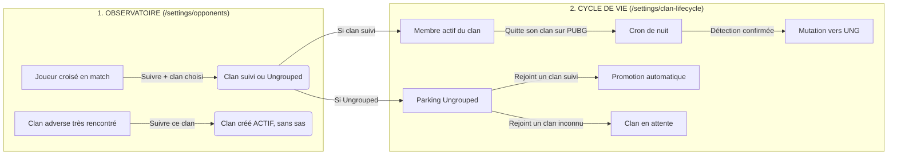

# Observatoire des Joueurs & Cycle de Vie des Clans

> **Spécification fonctionnelle — onglet « Joueurs » de `/settings/opponents`**
> *Destiné au SuperUser et à l'équipe de développement*
> *Date : 25 septembre 2026 — revue contre le code le même jour*
> *Statut : ✅ implémenté le 2026-09-25 (non déployé) — voir [§11](#11-implémentation-du-2026-09-25)*
>
> L'arrêt de suivi d'un clan (ancien §5) est un chantier distinct, qui modifie `clan-lifecycle` :
> voir [clan-archive.md](clan-archive.md).

---

## 1. Contexte & Problématique

Dans l'espace SuperUser, deux écrans gèrent les joueurs et les clans :

1. **`/settings/opponents`** (*« Adversaires »*) : observation des clans et joueurs croisés en match. Onglets
   actuels : `Explorer`, `Résolution & Jobs`, `Triage`.
2. **`/settings/clan-lifecycle`** (*« Cycle de vie des clans »*) : détection des changements de clan des membres
   suivis, parking `Ungrouped`, validation des nouveaux clans.

### Le constat d'usage

* **Une frontière floue** : la première page ajoute des joueurs et des clans (« Suivre », « Ajouter à
  l'effectif »), la seconde gère les mutations et les approbations.
* **Le chaînon manquant** : l'onglet `Triage` permet déjà de chercher un pseudo, mais sur `EncounteredPlayer`,
  c'est-à-dire **une ligne par clan suivi qui a croisé le joueur**, et **sans statut de suivi**. On ne peut pas
  savoir en une recherche si un joueur est membre suivi (et de quel clan), archivé, ou simple joueur croisé.
* **Ce que l'onglet Joueurs apporte par rapport à Triage** : une ligne **par joueur** (`Player`), le **statut de
  suivi** calculé depuis `ClanMember`, et l'action de suivi. Triage reste l'outil de la file de résolution PUBG
  (statuts `never_attempted`, `failed`…), l'annuaire ne la reprend pas.

---

## 2. Le Modèle Mental : Découverte vs Gouvernance

```
MONDE EXTÉRIEUR (Matchs PUBG)
         │
         ▼
┌─────────────────────────────────────────────────────────┐
│   1. OBSERVATOIRE & SCOUTING (/settings/opponents)      │
│   • Découverte de clans et joueurs croisés              │
│   • Annuaire transverse des joueurs (suivis / non)      │
│   • Triage technique et résolution de tags PUBG         │
│   • Décision de suivi : joueur -> Clan / Ungrouped      │
└──────────────────────────┬──────────────────────────────┘
                           │ Intégration dans le périmètre suivi
                           ▼
┌─────────────────────────────────────────────────────────┐
│   2. CYCLE DE VIE & GOUVERNANCE (/settings/clan-lifecycle)
│   • Vérité terrain : détection des départs / arrivées   │
│   • Gestion des mutations (transferts, rétrogradations) │
│   • Sas de validation des clans en attente              │
│   • Parking Ungrouped & archivage d'inactivité          │
└─────────────────────────────────────────────────────────┘
```

| Dimension | `/settings/opponents` (Observatoire & Joueurs) | `/settings/clan-lifecycle` (Gouvernance) |
| :--- | :--- | :--- |
| **Finalité** | Scouting, découverte & annuaire | Cohérence, vérité terrain & règles métier |
| **Public ciblé** | Tout joueur PUBG croisé en match (inconnu, adverse ou déjà suivi) | Les membres et clans **déjà dans le périmètre suivi** |
| **Question** | *« Qui avons-nous croisé ? Le joueur X est-il suivi ? Quel est son clan PUBG ? Voulons-nous le suivre ? »* | *« Nos membres sont-ils toujours dans leur clan PUBG ? Qui a changé ? Quels clans attendent validation ? »* |
| **Joueurs** | Recherche transverse, statut de suivi, action **« Suivre »** | Détection quotidienne des écarts, mutations, archivage au parking |
| **Clans** | Clans rivaux par volume de rencontres, part affrontements / *fill squad*, favoris | Approbation / refus des clans en attente, coupe-circuit, confirmations |

---

## 3. Spécification : l'onglet « Joueurs » (`/settings/opponents/players`)

### A. Objectifs

1. **Recherche** : trouver un joueur par son pseudo PUBG sans connaître son clan.
2. **Statut de suivi immédiat** (règles exactes au §3.C).
3. **Action directe** : suivre le joueur dans un clan choisi, ou le transférer avec confirmation.

### B. Maquette

#### 1. Compteurs (4 cartes)

| Carte | Définition exacte |
|---|---|
| **Joueurs répertoriés** | Nombre de `Player` (tous shards) |
| **Membres suivis** | `Player` ayant un statut 🟢 ou 🔵 (§3.C) |
| **Joueurs non suivis** | `Player` au statut ⚪ |
| **Joueurs solo** | `Player` **résolus** sans clan : `clanResolvedAt IS NOT NULL AND opponentClanId IS NULL` |

Un joueur jamais résolu (`clanResolvedAt IS NULL`) n'est **pas** solo : son clan est inconnu. Les compteurs
doivent être égaux au `total` renvoyé par le filtre correspondant.

#### 2. Filtres & recherche

* **Segmented Control** (`SegmentedControl`) : `Tous` · `Suivis` (🟢 + 🔵) · `Non suivis` (⚪) ·
  `Sans clan PUBG` (solo résolu) · `Favoris ⭐`.
* **Recherche** sur `pubgPlayerName`, même convention que Triage : **préfixe** par défaut, **sous-chaîne** si la
  saisie commence par `*`. Les caractères `%` et `_` saisis sont cherchés littéralement (ex. `Lord_Kromb` ne doit
  pas trouver `LordXKromb`). L'insensibilité à la casse et aux accents vient de la collation MySQL, pas du code.
* **Filtre « Croisés par »** : sélecteur d'un clan suivi → joueurs ayant un `ClanEncounter` avec ce clan.

#### 3. Tableau

| Joueur | Statut de suivi | Clan PUBG (in-game) | Rencontres | Dernière vue | Actions |
| :--- | :--- | :--- | :--- | :--- | :--- |
| ⭐ **Lord_Kromb** | 🟢 `[SMK] Smoke` | `[SMK] Smoke` | **84** *(72 ennemi / 12 fill)* | *il y a 2 h* | [Profil interne] [Lookup ↗] |
| ☆ **ShadowSniper** | ⚪ `Non suivi` | `[RATZ] Ratz Gang` | **18** *(18 / 0)* | *il y a 3 j* | **[+ Suivre ▾]** [Lookup ↗] |
| ☆ **RandomGuy99** | ⚪ `Non suivi` | *Solo* | **4** *(1 / 3)* | *il y a 5 j* | **[+ Suivre ▾]** [Lookup ↗] |
| ☆ **Drifter** | 🔵 `[UNG] Parking` | *Solo* | **12** *(12 / 0)* | *il y a 1 j* | [Profil interne] [→ Parking] [Lookup ↗] |
| ☆ **OldMember** | 🟡 `Archivé (inactivité)` | `[WLF] Wolfpack` | **29** *(29 / 0)* | *il y a 18 j* | **[Réactiver / Déplacer ▾]** [Lookup ↗] |

* **Rencontres** = somme de `ClanEncounter.encounterCount` sur tous les clans suivis ; « fill » =
  somme de `teammateEncounterCount` ; « ennemi » = différence.
* **Clan PUBG** = `Player.opponentClan` ; *« Inconnu »* si `clanResolvedAt IS NULL`, *« Solo »* si résolu sans clan.
* **Lookup** : `https://pubglookup.com/players/{platformShard}/{pubgPlayerName}` (encodé) — le shard vient de
  `Player.platformShard`, jamais codé en dur à `steam`.

#### 4. Actions

* **« Suivre dans un clan »** : popover listant les clans suivis actifs et `Ungrouped (UNG)`, puis
  `POST /api/settings/opponents/track` avec **toujours** un `targetClanId` explicite.
  * Sans `targetClanId`, la route appelle `ensureTrackedClanForPlayer`, qui **interroge l'API PUBG** et peut
    **créer un clan actif** sans passer par le sas de validation. L'annuaire ne doit pas emprunter ce chemin.
  * Joueur sans fiche `ClanMember` → création d'un membre `isActive: true, joinStatus: 'active'`.
  * Membre actif d'un autre clan suivi → **409 `member_tracked_elsewhere`** avec `currentClan` ; l'UI affiche le
    message et renvoie la requête avec `confirmMove: true` si le SuperUser confirme.
  * Membre archivé, suivi arrêté ou demande en attente → réactivé **sans confirmation** par la route actuelle
    (voir §3.E).
* **Favori ⭐** : `PATCH /api/settings/players/[id]/favorite` avec `{ isFavorite: boolean }`.
* **Profil interne** : `/members/[clanMemberId]/dashboard` (il n'y a pas de page à la racine de
  `/members/[id]`), affiché seulement si une fiche `ClanMember` existe.
* **→ Parking** : lien vers l'onglet `Ungrouped` de `clan-lifecycle` pour un joueur 🔵.

### C. Règles de classification

**Rattachement** : la fiche `ClanMember` d'un joueur se trouve par `ClanMember.playerId = Player.id` **ou** par
`(pubgAccountId, platformShard)` identiques. `ClanMember.playerId` est nullable et n'est renseigné que par
`syncOpponentIdentityForMemberId` : se fier au seul `Player.clanMembers` classerait des membres en « non suivis ».

| Statut | Condition sur la fiche `ClanMember` | Badge |
|---|---|---|
| **Membre suivi** | `isActive = true`, `joinStatus = 'active'`, clan actif non système | 🟢 `[TAG] Nom du clan` |
| **Au parking** | idem, clan `isSystem = true` | 🔵 `[UNG] Parking` |
| **Demande en attente** | `joinStatus = 'pending'` | 🟠 `Adhésion en attente` |
| **Archivé (inactivité)** | `isActive = false`, `archivedReason = 'ungrouped_inactive'` | 🟡 `Archivé (inactivité)` |
| **Suivi arrêté** | `isActive = false`, autre cas (retrait manuel, rejet, arrêt de suivi du clan) ; **ou** actif dans un clan inactif ou absent ; **ou** `joinStatus` hors `active` / `pending` (`left`, `rejected`, ancienne watchlist `tracked`) — le motif s'affiche en infobulle | ⚫ `Suivi arrêté` |
| **Non suivi** | aucune fiche `ClanMember` | ⚪ `Non suivi` |

Pour le filtre `Suivis` : 🟢 + 🔵. Pour `Non suivis` : ⚪ seulement. Les statuts 🟠, 🟡 et ⚫ n'apparaissent que
sous `Tous` (et dans la recherche). Si un joueur a plusieurs fiches, la plus forte l'emporte
(🟢 > 🔵 > 🟠 > 🟡 > ⚫, puis la plus récente) — aucun cas en production au 2026-09-25.

**Membres suivis sans ligne `Player`** : ils ne peuvent pas figurer dans un annuaire construit sur `Player`.
Au 2026-09-25, 4 membres actifs sur 398 sont dans ce cas (`bibou5996` [SMK], `kayzo59` et `St4nBear` [BDXX],
`Gratobuche` [RATZ]). L'écran les liste dans un encart. `scripts/resync-player-clan-identity.ts` ne les répare
pas (jointure interne sur `Player`) : leur ligne se crée au premier match qui les croise, ou à la
resynchronisation de leur fiche (`syncOpponentIdentityForMemberId`).

### D. Performance — mesurée le 2026-09-25

Mesures en production, lecture seule (`scripts/check-players-directory-cost.ts`) : **520 913 `Player`**,
**2 146 307 `ClanEncounter`**, 406 `ClanMember`, 12 299 `OpponentClan`, un seul shard (`steam`).

| Requête | Temps | Conséquence dans le code |
|---|---|---|
| Tri par rencontres de **tous** les joueurs (agrégat complet de `ClanEncounter`) | **204 s** | Tri servi seulement si le filtre retient ≤ 5 000 joueurs ; sinon repli sur la dernière vue, signalé à l'écran |
| Tri par dernière vue (aucun index ne commence par `lastSeenAt`) | 1,5 à 1,8 s | Accepté ; index proposé dans [database-performance.md §4.6](../ops/database-performance.md) |
| Tri par pseudo (`Player_pubgPlayerName_idx`) | 20 ms | — |
| `COUNT` solo / favoris (pas d'index adapté) | 1,3 s chacun | Compteurs calculés à la demande (`counters=1`) : premier chargement et après une action, pas à chaque page |
| `COUNT(*)` | 0,3 s | Partagé entre le compteur « Joueurs répertoriés » et le total de la liste sans filtre |
| Recherche par préfixe / sous-chaîne | 0,16 s / 1,9 s | Préfixe par défaut |

De bout en bout avec le code réel : 0,3 s (préfixe) à 4,1 s (« Croisés par » le plus gros clan), 2 s pour la vue
par défaut. Pas de cache côté serveur : les compteurs à la demande suffisent et n'introduisent aucune
donnée périmée.

### E. Défauts existants à traiter dans ce chantier

| Défaut | Où | État au 2026-09-25 |
|---|---|---|
| `favorite` sur un id inconnu répond **500** (P2025 non intercepté) au lieu de 404 ; un corps JSON invalide aussi | [favorite/route.ts](../../src/app/api/settings/players/[id]/favorite/route.ts) | ✅ Corrigé : 404 et 400. Les deux tests échouent sur l'ancienne version |
| `track` réactive un membre archivé, rejeté ou en attente **sans confirmation** | [track/route.ts:61-65](../../src/app/api/settings/opponents/track/route.ts#L61-L65) | Route inchangée, comportement verrouillé par un test. L'annuaire demande la confirmation **côté interface** avant d'appeler la route (§10) |
| `track` : la création d'un nouveau membre n'écrit **aucune ligne `PlayerClanChange`** (seule la mise à jour en écrit) | [track/route.ts:136-149](../../src/app/api/settings/opponents/track/route.ts#L136-L149) | Inchangé, verrouillé par un test — à trancher (§10) |
| `track` retrouve un membre aussi par `pubgPlayerName` seul — risque de collision après un changement de pseudo | [track/route.ts:40-48](../../src/app/api/settings/opponents/track/route.ts#L40-L48) | Inchangé, verrouillé par un test |
| Recherche : Prisma **n'échappe pas** `_` ni `%` dans `startsWith` / `contains` (`startsWith('a_')` : 36 416 joueurs au lieu de 285) | Découvert à la mesure | ✅ L'annuaire échappe lui-même. ⚠️ La recherche de l'onglet **Triage** ([encountered-players/route.ts:84-88](../../src/app/api/settings/encountered-players/route.ts#L84-L88)) a le même défaut, non corrigé |

---

## 4. Rappel : `/settings/clan-lifecycle`

La page [clan-lifecycle](../../src/app/settings/clan-lifecycle/page.tsx) compte 5 onglets. **Ce chantier ne
modifie pas sa logique** (voir §9.C).

1. **Mutations** — journal `PlayerClanChange`. Le cron `clan_lifecycle_membership_sync` (01 h 45) compare le clan
   PUBG réel de chaque membre suivi à son clan sur le site. Statuts : `observed` (écart en attente de
   confirmations), `pending` (vers un clan pas encore validé), `applied`, `ignored` (écarté), `reverted` (annulé).
   Actions : `Annuler` (replace le joueur et journalise l'inverse), `Marquer comme vu` (acquittement).
2. **Clans en attente** — clans `isActive = false, isSystem = false, archivedAt = null`. Origine `auto_detected`
   (découvert par le cron) ou `join_request` (demande `/join`, avec Owner). `Valider` →
   `POST /api/clans/[clanId]/approve` (active le clan, applique les promotions en attente) ; `Refuser` →
   `POST /api/clans/[clanId]/reject`, qui archive le clan depuis le 2026-09-25 (il passe dans « Clans archivés »,
   onglet ajouté par [clan-archive.md](clan-archive.md)).
3. **Parking Ungrouped** — joueurs suivis sans clan (`Clan.isSystem = true`). Un appel API PUBG par joueur et par
   jour. Au-delà de `archiveAfterDays` (90 j par défaut) sans match : candidats à l'archivage
   (`isActive = false`, `archivedReason = 'ungrouped_inactive'`).
4. **Paramètres** — mode `Observation` / `Application`, confirmations exigées, coupe-circuit (% de l'effectif),
   archivage et promotion automatiques, webhook Discord d'administration.
5. **Santé** — derniers runs du cron (durée, membres analysés, appels API, anomalies bloquées).

---

## 5. Arrêt de suivi d'un clan

Sorti de ce document : **[clan-archive.md](clan-archive.md)**, implémenté le 2026-09-25. En résumé : un état
« archivé » distinct (`Clan.archivedAt`), parce que `Clan.isActive = false` signifiait déjà « clan en attente ».
Les fiches désactivées par un archivage apparaissent dans l'annuaire en ⚫ « Suivi arrêté », motif « son clan n'est
plus suivi » (`clan_unfollowed`).

---

## 6. Interactions entre les deux pages



1. **Passerelle A — recrutement d'un joueur croisé** : depuis l'annuaire, `Suivre` → `Ungrouped` ou un clan
   suivi. Le joueur entre dans le périmètre de `clan-lifecycle`.
2. **Passerelle B — promotion d'un clan adverse** : `Suivre ce clan` (`POST /api/settings/clans`) crée le clan
   **directement actif**. Le sas « Clans en attente » ne concerne que les clans détectés par le cron et les
   demandes `/join`.
3. **Passerelle C — départ de clan** : un membre de `[SMK]` quitte son clan. L'Observatoire ne modifie rien ; le
   cron constate l'écart sur le nombre de confirmations requis, journalise et transfère vers `Ungrouped`.
4. **Passerelle D — reclassement** : un joueur du parking rejoint `[BEE]` (clan suivi) → promotion automatique.
   S'il rejoint un clan inconnu, le cron ouvre une demande `auto_detected` et la promotion attend la validation.

---

## 7. Harmonisation de la navigation

### A. Onglets de `/settings/opponents` (renommage)

| Actuel | Proposé | Route |
|---|---|---|
| `Explorer` | **`Clans`** | `/settings/opponents` |
| — | **`Joueurs`** (nouveau) | `/settings/opponents/players` |
| `Résolution & Jobs` | **`Résolution & Cron`** | `/settings/opponents/resolution` |
| `Triage` | **`Triage API`** | `/settings/opponents/triage` |

Onglets définis dans [opponents/layout.tsx](../../src/app/settings/opponents/layout.tsx).

### B. Liens croisés

* ✅ Annuaire → `clan-lifecycle` : lien vers l'onglet `Ungrouped` pour un joueur 🔵 ; mini badge daté vers le
  journal des mutations si la fiche a une ligne `PlayerClanChange` de moins de 30 jours. La page
  `clan-lifecycle` lit désormais `?tab=` (`mutations`, `pending`, `ungrouped`, `settings`, `health`).
* ✅ `clan-lifecycle` → Observatoire : lien « Confrontations » sur chaque clan en attente, vers
  `/settings/opponents?opponentsQ=<tag>`. L'onglet `Clans` lit ce paramètre au chargement.
* L'annuaire lit aussi `?q=`, `?status=` et `?seenByClanId=`. Pas de lien retour depuis le parking : l'onglet
  `Ungrouped` ne connaît que `displayName`, qui peut différer du pseudo PUBG.

### C. Lexique

| Terme | Définition | Badge |
| :--- | :--- | :--- |
| **Membre suivi** | Joueur actif d'un clan suivi | 🟢 `[TAG] Nom du clan` |
| **Joueur au parking** | Joueur suivi rattaché au clan technique Ungrouped | 🔵 `[UNG] Parking` |
| **Adhésion en attente** | Demande `/join` pas encore validée | 🟠 `Adhésion en attente` |
| **Membre archivé** | Désactivé après une longue inactivité au parking | 🟡 `Archivé (inactivité)` |
| **Suivi arrêté** | Désactivé pour une autre raison | ⚫ `Suivi arrêté` |
| **Joueur non suivi** | Croisé en match, sans fiche membre | ⚪ `Non suivi` |
| **Clan suivi** | Clan actif, présent dans les classements | Badge plein avec effectif |
| **Clan en attente** | Découvert par le cron ou demandé via `/join` | 🟠 `En attente de validation` |
| **Clan adverse** | Clan PUBG croisé face à nos membres | 🔴 `Adverse` |

---

## 8. Modèle de données & endpoints

Extraits utiles de [schema.prisma](../../prisma/schema.prisma) — aucune migration n'est nécessaire pour l'annuaire.

```prisma
model Player {                     // identité PUBG globale, une ligne par (compte, shard)
  id             String  @id @default(cuid())
  pubgAccountId  String
  platformShard  String  @default("steam")
  pubgPlayerName String
  opponentClanId String?           // clan PUBG ; null = solo OU non résolu
  clanResolvedAt DateTime?         // null = jamais résolu
  isFavorite     Boolean @default(false)
  lastSeenAt     DateTime
  encounters     ClanEncounter[]
  clanMembers    ClanMember[]      // via ClanMember.playerId, nullable → ne pas s'y fier seul
  @@unique([pubgAccountId, platformShard])
  @@index([pubgPlayerName])
}

model ClanEncounter {              // rencontres d'un joueur par UN clan suivi
  clanId                 Int
  playerId               String
  encounterCount         Int       // total
  teammateEncounterCount Int       // dont en fill squad
  lastSeenAt             DateTime
  @@unique([clanId, playerId])
}

model ClanMember {                 // membre suivi
  clanId         Int?
  playerId       String?
  pubgAccountId  String?
  platformShard  String
  isActive       Boolean
  joinStatus     String            // 'active' | 'pending' | 'rejected' | 'left' | 'tracked' (ancienne watchlist)
  archivedAt     DateTime?
  archivedReason String?           // 'ungrouped_inactive' | …
}
```

`Player` et `ClanEncounter` sont écrits à chaque rencontre ([encountered-players.ts:171](../../src/lib/encountered-players.ts#L171)),
en double de `EncounteredPlayer` : l'annuaire lit le modèle normalisé.

### Endpoints

1. **Nouveau** : `GET /api/settings/players` (SuperUser) — [route.ts](../../src/app/api/settings/players/route.ts),
   logique dans [players-directory.ts](../../src/lib/players-directory.ts).
   * `q`, `status` (`all` | `tracked` | `untracked` | `noclan` | `favorites`), `seenByClanId`, `page`,
     `pageSize` (25 par défaut, plafonné à 100), `sortBy` (`lastSeenAt` | `totalEncounters` | `pubgPlayerName`),
     `sortOrder` (défaut : `asc` pour le pseudo, `desc` sinon), `counters=1` pour recevoir les compteurs.
   * Paramètre invalide → valeur par défaut (même comportement que `encountered-players`).
   * Retour : `rows` (une ligne par `Player` : statut et motif (§3.C), fiche membre, clan PUBG
     `clan` | `solo` | `unknown`, rencontres `total` / `asOpponent` / `asTeammate` / `distinctClanCount` et
     détail par clan, `lookupUrl`, mutation récente), `pagination`, `sort` (avec `fallback` quand le tri par
     rencontres est refusé), `counters` (ou `null`), `trackableClans` (clans actifs), `unlinkedMembers`.
2. **Existant** : `POST /api/settings/opponents/track` — `{ playerId, targetClanId, confirmMove? }`. L'annuaire
   envoie toujours `targetClanId`.
3. **Existant** : `PATCH /api/settings/players/[id]/favorite` — `{ isFavorite }` (404 corrigé, §3.E).

---

## 9. Tests & validation

### A. Emplacement

Vitest ne collecte que `src/lib/**/*.test.ts` : un test posé sous `src/app/` n'est jamais exécuté. Convention du
dépôt :

| Fichier | Contenu |
|---|---|
| `src/lib/players-directory.ts` | Classification (§3.C), construction de la requête, pagination |
| `src/lib/players-directory.test.ts` | Tests unitaires de ce module |
| `src/lib/players-directory-route-contracts.test.ts` | Handlers `GET /api/settings/players`, `track`, `favorite` importés depuis `src/app/` |

Les mocks Prisma listent les modèles un par un : un modèle oublié rend `undefined` et le test casse loin de la
cause.

### B. Matrice des tests automatisés

| Catégorie | Cas | Attendu |
| :--- | :--- | :--- |
| **Classification** | Fiche avec `playerId` renseigné | Statut selon §3.C |
| | `playerId` null, `pubgAccountId` + shard identiques | Classé suivi, pas « non suivi » |
| | Clan `isSystem` | 🔵 parking, compté dans `tracked` |
| | `joinStatus = 'pending'` | 🟠, exclu de `tracked` et de `untracked` |
| | `isActive = false` + `ungrouped_inactive` / autre raison | 🟡 / ⚫ |
| | Même `pubgAccountId` sur deux shards | Deux lignes distinctes |
| **Filtres** | `tracked` | 🟢 + 🔵 uniquement |
| | `untracked` | ⚪ uniquement |
| | `noclan` | `clanResolvedAt` non null **et** `opponentClanId` null ; les non résolus sont exclus |
| | `favorites` | `Player.isFavorite = true` |
| | `seenByClanId` combiné à un statut | Intersection des deux |
| **Agrégation** | Joueur croisé par `[SMK]` (10, dont 2 fill) et `[BEE]` (5, dont 1 fill) | Une seule ligne ; `totalEncounters = 15`, `teammateEncounters = 3`, `distinctClanCount = 2` |
| **Cohérence** | Compteurs | Chaque compteur égale le `total` du filtre correspondant ; `tracked + untracked ≤ all` |
| **Recherche** | Préfixe par défaut, sous-chaîne avec `*` | Clause `startsWith` / `contains` générée |
| | Saisie contenant `_` ou `%` | Recherche littérale (échappée si SQL brut) |
| | Saisie vide ou espaces | Aucun filtre de nom |
| **Pagination** | `page`, `pageSize`, `total`, `totalPages` | Calculés juste ; `pageSize` plafonné |
| | Tri avec ex æquo | Départage stable (par `id`) : ni doublon ni ligne perdue d'une page à l'autre |
| | Paramètres invalides | Valeurs par défaut |
| **Accès** | Sans session / non SuperUser | **401** / **403** (sur les trois routes) |
| **`track`** | Joueur sans fiche | `ClanMember` créé avec `playerId`, `isActive`, `joinStatus: 'active'` |
| | Membre actif d'un autre clan, sans `confirmMove` | 409 `member_tracked_elsewhere` + `currentClan`, aucune écriture |
| | Idem avec `confirmMove: true` | Déplacé + `PlayerClanChange` `source: 'manual_transfer'`, `triggeredByUserId` |
| | Déjà actif dans le clan cible | 400 |
| | Membre archivé / en attente | Comportement décidé au §10, verrouillé par le test |
| | Correspondance par `pubgPlayerName` seul | Comportement verrouillé par le test (§3.E) |
| | `playerId` inconnu / absent | 404 / 400 |
| **`favorite`** | Bascule | `isFavorite` mis à jour |
| | Id inconnu | 404 (aujourd'hui 500 — le test doit échouer avant le correctif) |
| | `isFavorite` non booléen | 400 |

L'insensibilité à la casse et aux accents relève de la collation MySQL : elle ne se prouve pas avec des mocks
Prisma et se vérifie en recette manuelle (scénario 1).

### C. Périmètre : on ne touche pas à la logique de `clan-lifecycle`

L'annuaire **lit** les statuts et initie un suivi via `track`, route déjà existante. Une fois le joueur suivi,
`clan-lifecycle` prend le relais sans modification. Sa suite de tests (`src/lib/clan-lifecycle/*.test.ts`) doit
rester verte sans être modifiée. Seule interaction : des liens de navigation (§7.B).

L'arrêt de suivi d'un clan, lui, modifie `clan-lifecycle` : c'est pour cela qu'il est traité dans
[clan-archive.md](clan-archive.md).

### D. Recette manuelle

1. **Recherche d'un membre** : saisir le pseudo d'un membre de `SMK` en minuscules → badge 🟢 `[SMK]`, lien vers
   son profil interne.
2. **Recrutement** : filtre `Non suivis`, `+ Suivre ▾` → `Ungrouped (UNG)` → notification de succès, badge 🔵
   **sans rechargement**, compteurs mis à jour.
3. **Conflit 409** : suivre dans le clan B un membre actif du clan A → message *« [Joueur] est déjà membre actif
   de [Clan A]. Confirmez le transfert. »*. Annuler : rien ne change. Confirmer : transfert visible dans le
   journal des mutations de `clan-lifecycle`.
4. **Favoris** : étoile sur un joueur, puis pilule `Favoris ⭐` → seuls les favoris s'affichent.
5. **Lookup** : l'icône ouvre dans un nouvel onglet la page PUBG Lookup du joueur **sur son shard**.
6. **Statuts rares** : retrouver un joueur ⚫ sous `Tous` (8 fiches en production au 2026-09-25 : 5 `left`,
   2 désactivées, 1 `rejected`) et lire son motif en infobulle. Aucun 🟡 ni 🟠 à cette date.
7. **Accès** : un compte non SuperUser voit l'écran « Accès restreint ».
8. **Thèmes & mobile** : rendu clair et sombre, tableau sans débordement horizontal de page sur mobile.
9. **Temps de réponse** : de l'ordre de 2 s pour la vue par défaut (§3.D).
10. **Tri par rencontres** : sous `Tous`, un encart signale le repli sur la dernière vue ; sous `Suivis`, le tri
    s'applique (≈ 1,7 s).
11. **Réactivation** : `Réactiver dans…` sur un joueur ⚫ → confirmation demandée avant l'appel.
12. **Encart des membres sans identité** : les 4 membres cités au §3.C apparaissent, avec un lien vers leur profil.
13. **Liens profonds** : l'icône parking d'un joueur 🔵 ouvre l'onglet `Ungrouped` ; « Confrontations » sur un
    clan en attente ouvre l'onglet `Clans` filtré sur son tag.

---

## 10. Questions ouvertes

- [ ] `track` sur un membre archivé, rejeté ou en attente : l'annuaire demande confirmation **côté interface**.
      Faut-il aussi un garde-fou **serveur** (409 comme pour un membre actif) ? Les autres écrans qui appellent
      `track` (onglet `Clans`) n'en bénéficient pas.
- [ ] `track` : journaliser l'entrée d'un nouveau joueur dans le périmètre (`PlayerClanChange` sans clan précédent) ?
- [ ] Faut-il un filtre dédié aux 🟠 / 🟡 / ⚫, ou `Tous` + recherche suffit-il ?
- [x] Mesure de volumétrie et `EXPLAIN` avant de figer la requête — fait le 2026-09-25 (§3.D)
- [ ] Ajouter l'index `Player(lastSeenAt)` ? Proposé, non appliqué :
      [database-performance.md §4.6](../ops/database-performance.md)
- [ ] Corriger l'échappement de `_` / `%` dans la recherche de l'onglet Triage (§3.E)

---

## 11. Implémentation du 2026-09-25

**Non déployé, non commité.** Aucune écriture en base : ni migration, ni backfill.

| Fichier | Rôle |
|---|---|
| [src/lib/players-directory.ts](../../src/lib/players-directory.ts) | Paramètres, classification, rattachement membre → joueur, filtres, tris, agrégation des rencontres |
| [src/app/api/settings/players/route.ts](../../src/app/api/settings/players/route.ts) | `GET /api/settings/players` |
| [src/app/settings/opponents/players/page.tsx](../../src/app/settings/opponents/players/page.tsx) | L'onglet : compteurs, filtres, tableau, actions, légende |
| [src/app/api/settings/players/[id]/favorite/route.ts](../../src/app/api/settings/players/[id]/favorite/route.ts) | 404 sur id inconnu, 400 sur JSON invalide |
| [src/app/settings/opponents/layout.tsx](../../src/app/settings/opponents/layout.tsx) | Onglets renommés (§7.A), défilement horizontal des onglets sur mobile |
| [src/app/settings/opponents/page.tsx](../../src/app/settings/opponents/page.tsx) | Lit `?opponentsQ=` (frontière `Suspense`) |
| [src/app/settings/clan-lifecycle/page.tsx](../../src/app/settings/clan-lifecycle/page.tsx) | Lit `?tab=` (frontière `Suspense`), lien « Confrontations » — aucune logique modifiée |
| [scripts/check-players-directory-cost.ts](../../scripts/check-players-directory-cost.ts) | Mesures §3.D, en lecture seule |

**Vérifications** : `tsc` sans erreur ; ESLint sans erreur sur les nouveaux fichiers, et aucun signalement
ajouté sur les fichiers modifiés. 62 tests ajoutés (43 unitaires, 19 de contrat) ; suite complète :
702 tests passés, 1 ignoré. Le code réel a tourné en lecture seule sur la base de production
(`--directory`) pour les 12 combinaisons de filtres : résultats cohérents avec les comptages SQL.
**Interface non vérifiée dans un navigateur** : la recette du §9.D reste à faire.

**Écarts avec la spécification** :
- le tri par rencontres est borné à 5 000 joueurs candidats (§3.D) au lieu d'être toujours proposé ;
- l'action « Suivre » est une liste déroulante native, pas un popover : un menu positionné en absolu serait
  rogné par le conteneur défilant du tableau ;
- le statut ⚫ couvre aussi les membres actifs d'un clan inactif et l'ancienne watchlist (§3.C).
