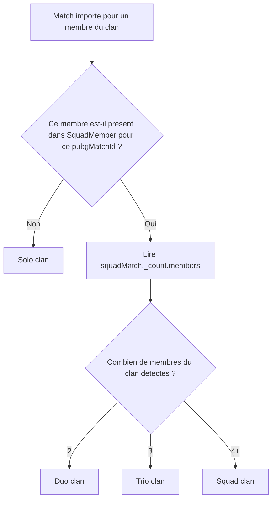

# Logique de calcul du leaderboard

Ce document explique comment est calculée la page de classement du clan, et clarifie la différence entre les modes PUBG, les groupes détectés côté app, et les calculs cron historiques.

## Résumé rapide

- Le leaderboard affiché sur `/clans/[clanId]/leaderboard` est recalculé à la volée dans l'API `src/app/api/clans/[clanId]/leaderboard/route.ts`.
- Ce calcul dépend de trois filtres UI: la période, le tri et le toggle `Clan` / `Inclus Solo`.
- Le mode PUBG d'un match (`solo`, `duo`, `trio`, `squad`) n'est pas la même chose que le mode clan de l'application (`solo clan`, `duo clan`, `trio clan`, `squad clan`).
- Les cron continuent d'alimenter `playerStats`, mais la page leaderboard ne lit plus directement ces valeurs pour ses chiffres principaux.
- `playerStats` sert encore pour l'indicateur `lastUpdatedAt` et pour les stats historiques calculées par cron.

## Deux notions a ne pas confondre

### 1. Mode PUBG

Chaque match a un mode natif fourni par PUBG via `Match.gameMode`:

- `solo`
- `duo`
- `trio`
- `squad`

Ce mode décrit le type de playlist PUBG.

### 2. Mode clan de l'application

L'application détecte aussi combien de membres du clan jouent ensemble dans un match via `SquadMatch` et `SquadMember`.

Cela produit un classement applicatif distinct:

- `solo clan` si un seul membre du clan est présent dans le match
- `duo clan` si 2 membres du clan sont présents dans le même match détecté
- `trio clan` si 3 membres du clan sont présents
- `squad clan` si 4 membres du clan ou plus sont présents

Important:

- un match PUBG `squad` peut n'être qu'un `duo clan` si seulement 2 membres du clan y participent
- un match PUBG `duo` peut être un `duo clan` si les 2 joueurs sont membres du clan
- un match PUBG `solo` est un `solo clan` s'il n'y a qu'un membre du clan dans la partie
- un match PUBG `squad` peut être `solo clan` si un seul membre du clan y participe

## Schema de decision (mode clan)

Le classement applicatif se base sur le nombre de membres du clan detectes dans un meme match, pas sur le mode PUBG seul.

Lecture rapide:

- Si pas d entree `SquadMember` pour le membre sur ce match, alors c est `solo clan`.
- Sinon, la classe (`duo/trio/squad clan`) depend de `_count.members`.
- Le mode PUBG (`solo`, `duo`, `trio`, `squad`) reste informatif mais ne suffit pas a classer le mode clan.

## Source des donnees de la page leaderboard

La page `/clans/[clanId]/leaderboard` utilise l'API:

- `GET /api/clans/[clanId]/leaderboard`

Le calcul principal est dans:

- `src/app/api/clans/[clanId]/leaderboard/route.ts`

Cette route fait les etapes suivantes:

1. lire le clan actif
2. lire les membres actifs du clan
3. convertir la periode UI (`week`, `month`, `all`) en plage de dates
4. charger deux jeux de donnees brutes:
   - tous les matchs individuels du membre depuis `Match`
   - les matchs de clan detectes depuis `SquadMember` + `SquadMatch`
5. agreger toutes les stats membre par membre selon le toggle `Clan` / `Inclus Solo`
6. trier les entrees selon `kills`, `kpm`, `damage`, `winRate` ou `matches`
7. recalculer les cartes `Top performers`
8. recalculer la progression sur les 4 periodes precedentes a partir des memes regles

## Periode appliquee

La periode est toujours appliquee avant l'agregation.

### `week`

- du lundi 00:00:00 au dimanche 23:59:59.999

### `month`

- du premier jour du mois 00:00:00 au dernier jour du mois 23:59:59.999

### `all`

- toutes les donnees disponibles

Cette logique est partagee par:

- `getDateRangeForPeriod()` pour la periode courante
- `getDateRangeForPeriodKey()` pour la progression des periodes passees

## Donnees lues pour le leaderboard

### Matchs `solo clan`

Les matchs `solo clan` sont derives depuis la table `Match`, quel que soit le `gameMode` PUBG.

Un match compte comme `solo clan` quand:

- le membre a un enregistrement `Match`
- mais n'a pas d'enregistrement `SquadMember` pour ce meme `pubgMatchId`

Autrement dit, `solo clan` veut dire: un seul membre du clan est present dans le match, meme si la playlist PUBG est `duo`, `trio` ou `squad`.

Les champs utilises sont:

- `memberId`
- `kills`
- `damageDealt`
- `assists`
- `revives`
- `placement`
- `pubgCreatedAt`

### Matchs de clan detectes

Les matchs joues avec d'autres membres du clan passent par:

- `SquadMember`
- `SquadMatch`

Les champs utilises sont:

- `memberId`
- `kills`
- `damage`
- `assists`
- `revives`
- `placement`
- `squadMatch._count.members`
- `squadMatch.createdAt`

`squadMatch._count.members` determine ensuite si la contribution est classee en:

- `duoClanKills`
- `trioClanKills`
- `squadClanKills`

## Regle de calcul du toggle

Le toggle UI est porte par `killsView`:

- `clan`
- `withSolo`

### Mode `Clan`

En mode `Clan`, seules les donnees issues des matchs detectes entre membres du clan sont ajoutees aux stats principales:

- `totalKills`
- `totalDamage`
- `totalAssists`
- `totalRevives`
- `matchesPlayed`
- `matchesWon`

Les matchs `solo clan` ne sont pas inclus dans ces totaux.

En revanche, la colonne `soloKills` reste renseignee a titre informatif pour montrer le volume `solo clan` sur la periode.

### Mode `Inclus Solo`

En mode `Inclus Solo`, les memes totaux incluent:

- les matchs `solo clan`
- plus les matchs de clan detectes

Autrement dit, tous les chiffres du leaderboard sont recalcules avec les solos ajoutes:

- kills
- damage
- assists
- revives
- matchs
- wins
- win rate
- moyennes par partie
- top performers
- progression

## Formules utilisees

Une fois les evenements agreges, les champs derives sont recalcules:

- `winRate = matchesWon / matchesPlayed` si `matchesPlayed > 0`, sinon `0`
- `avgKillsPerGame = totalKills / matchesPlayed` si `matchesPlayed > 0`, sinon `0`
- `avgDamagePerGame = totalDamage / matchesPlayed` si `matchesPlayed > 0`, sinon `0`

## Comment les performances sont calculees dans le tableau

Cette section decrit l ordre exact de calcul pour les chiffres visibles dans les lignes joueur.

1. Filtrer les matchs par periode (`week`, `month`, `all`).
2. Agreger les matchs de clan detectes (`SquadMember`) dans les totaux principaux.
3. Identifier les matchs `solo clan` via `Match` non presents dans `SquadMember` pour le meme `memberId + pubgMatchId`.
4. Selon le toggle:
   - `clan`: les matchs solo ne sont pas ajoutes aux totaux principaux.
   - `withSolo`: les matchs solo sont ajoutes aux totaux principaux.
5. Recalculer les metriques derivees par joueur:
   - `winRate`
   - `avgKillsPerGame` (colonne `K/M`)
   - `avgDamagePerGame`
6. Trier le leaderboard selon le critere actif (`kills`, `kpm`, `damage`, `winRate`, `matches`).
7. Afficher les deltas de progression (si disponibles) en comparant la periode courante et la periode precedente pour tous les joueurs du classement.

### Detail des valeurs visibles

- `Kills`: `totalKills` (apres application du toggle)
- `Matchs`: `matchesPlayed`
- `Damage`: `totalDamage`
- `K/M`: `avgKillsPerGame`, formate avec 2 decimales (`fr-FR`)
- `Winner`: `matchesWon`
- `Win Rate`: `winRate * 100` affiche en pourcentage
- `Solo`, `Duo`, `Trio`, `Squad`: repartition des kills par mode clan

### Regles de progression (fleches)

Les deltas affiches sous certaines colonnes sont calcules entre la periode courante et la periode precedente:

- `killsDelta = current.totalKills - previous.totalKills`
- `matchesDelta = current.matchesPlayed - previous.matchesPlayed`
- `damageDelta = round(current.totalDamage - previous.totalDamage)`
- `winnerDelta = current.matchesWon - previous.matchesWon`
- `winRateDelta = (current.winRate - previous.winRate) * 100`

Codes visuels:

- `↑` vert: delta positif
- `↓` rouge: delta negatif
- `→` gris: delta nul
- `•` gris: progression indisponible

Note:

- la colonne `K/M` n affiche pas de delta dans la table actuelle (valeur courante uniquement).
- en periode `all`, les deltas de performance sont masques dans l UI (pas de comparaison temporelle pertinente).

## Colonnes du tableau

Le tableau de leaderboard affiche:

- `Kills`: `totalKills`
- `Matchs`: `matchesPlayed`
- `Damage`: `totalDamage`
- `K/M`: `avgKillsPerGame`
- `Winner`: `matchesWon`
- `Win Rate`: `winRate`
- `Solo`: `soloKills` = kills en `solo clan`
- `Duo clan`: `duoClanKills`
- `Trio clan`: `trioClanKills`
- `Squad clan`: `squadClanKills`

Important:

- la colonne `Solo` represente le mode `solo clan`, pas uniquement les matchs PUBG `solo`
- la colonne `Solo` reste une colonne de decomposition informative
- en mode `Inclus Solo`, `Kills` inclut bien `Solo + Duo clan + Trio clan + Squad clan`

## Top performers

Les cartes `Top performers` sont recalculees a partir des entrees deja agregees de la periode et du mode courant.

Elles suivent donc exactement le meme perimetre que le tableau.

Les cartes sont:

- `Top Killer`: plus grand `totalKills`
- `Top Damage`: plus grand `totalDamage`
- `Best Win Rate`: plus grand `winRate` parmi les joueurs avec au moins 3 matchs
- `MVP`: score combine a partir de `totalKills`, `totalDamage` et `winRate`
- `TOP Kills/Matchs`: plus grand ratio `totalKills / matchesPlayed` (joueurs avec >= 3 matchs, sinon fallback sur tous les joueurs avec matchs)

Les memes distinctions sont affichees dans la colonne joueur du tableau principal (desktop + mobile):

- `top_killer`
- `top_damage`
- `best_wr`
- `mvp`
- `best_kpm`

Le score MVP est calcule comme une somme normalisee:

- `score = totalKills / maxKills + totalDamage / maxDamage + winRate`

## Progression

La progression ne lit pas un historique pre-stocke pour cette page.

Elle est reconstruite a la volée sur les 4 dernieres periodes pertinentes:

- 4 semaines pour `week`
- 4 mois pour `month`
- aucune progression pour `all`

En periode `all`, la table conserve les valeurs absolues (kills, matchs, damage, etc.) mais n affiche pas les indicateurs de performance (fleches/deltas).

Pour chaque periode passee, l'API recharge les matchs individuels et les `SquadMember` pour tous les joueurs du leaderboard, puis reapplique exactement la meme aggregation que pour la periode courante.

Resultat:

- la progression suit aussi `Clan` / `Inclus Solo`
- la progression reste coherente avec le tableau principal

## Impact performance et garde-fous

Le passage de la progression du `top 5` a tous les joueurs augmente le volume de calcul.

Complexite pratique actuelle:

- 1 agregation complete pour la periode courante
- + 4 agregations pour `week` ou `month` (une par periode passee)
- chaque agregation parcourt tous les joueurs du leaderboard

Points a surveiller:

- temps de reponse de l endpoint `GET /api/clans/[clanId]/leaderboard`
- charge SQL (lectures `Match` + `SquadMember`)
- experience UI quand la periode est `all` sur des clans tres volumineux

Garde-fous recommandes (si la volumetrie augmente):

1. Limite configurable sur la progression:
   - ex: `LEADERBOARD_PROGRESSION_MAX_MEMBERS`
   - appliquee seulement au bloc progression, pas au tableau principal
2. Degradation douce cote UI:
   - si la progression est tronquee, afficher une mention claire (ex: `Progression calculee sur les X premiers`)
3. Cache court de la reponse leaderboard:
   - TTL faible (30-120s) pour absorber les rafales de refresh
4. Monitoring:
   - tracer la duree du calcul et le nombre de joueurs traites
   - alerter si la latence depasse un seuil cible

Etat actuel du projet:

- la progression est calculee pour tous les joueurs du classement
- aucun cap de securite n est applique pour le moment

## Rôle restant des cron

Le cron de recalcul dans `src/lib/stats-calculator.ts` continue a alimenter `PlayerStats`.

Ce calcul cron:

- ne prend en compte que `SquadMember`
- ignore les matchs solo de `Match`
- sert a maintenir les stats historisees basees sur `playerStats`

Aujourd'hui, il y a donc deux logiques coexistantes:

### Logique live du leaderboard

- source: `Match` + `SquadMember`
- respecte `Clan` / `Inclus Solo`
- recalcule toutes les metriques affichees

### Logique cron de `playerStats`

- source: `SquadMember` uniquement
- sert au recalcul periodique historique
- ne suit pas encore automatiquement le toggle `Inclus Solo`

## Point d'attention actuel

Le leaderboard live et `playerStats` ne sont plus strictement identiques sur tous les champs.

Concretement:

- la page leaderboard affiche des chiffres recalcules live selon le mode choisi
- `lastUpdatedAt` provient encore des lignes `playerStats`
- les badges affiches sur la page leaderboard sont calcules a la volee a partir des donnees live

Si l'objectif est d'avoir une coherence totale entre UI, badges, cron et donnees stockees, il faudra ensuite aligner `src/lib/stats-calculator.ts` sur la meme logique que `src/app/api/clans/[clanId]/leaderboard/route.ts`.

## Fichiers a connaitre

- `src/app/api/clans/[clanId]/leaderboard/route.ts`: calcul live du leaderboard
- `src/components/Leaderboard.tsx`: tableau principal
- `src/components/LeaderboardStats.tsx`: cartes Top performers
- `src/hooks/useLeaderboard.ts`: chargement client de l'API
- `src/lib/stats-calculator.ts`: recalcul cron de `playerStats`
